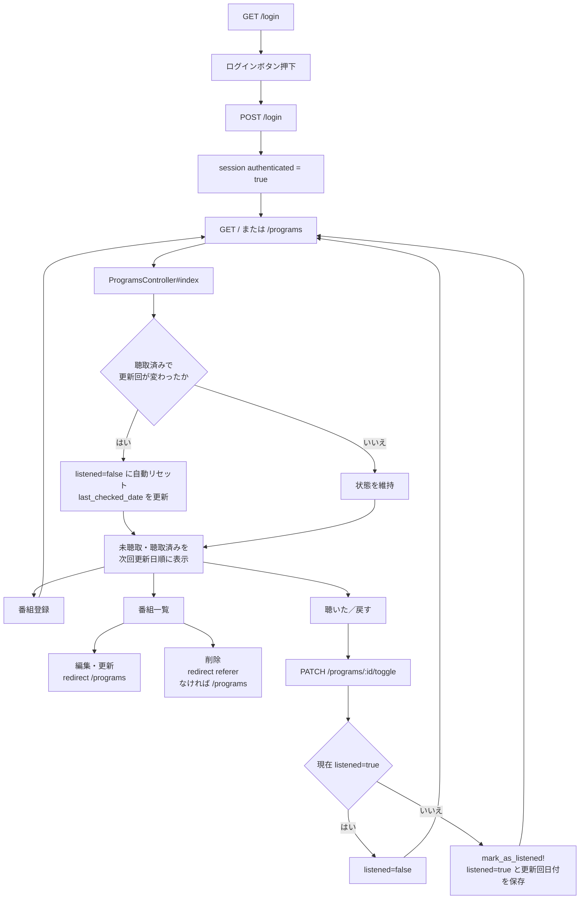

# Radio Manager アプリケーション概要

## 1. 文書の目的

本書は、Radio Manager の現行実装を、利用者・運用者・今後の開発担当者が共通理解できるように整理したものである。記載はリポジトリ内のコード、データベーススキーマ、テストコードに基づく。未実行の検証やリポジトリから判断できない運用情報は、事実と分けて記載する。

- 最終確認日: 2026-08-12（認証方式の変更に伴い、第4節・第7節・第9.1節・第11節を更新）
- 確認対象: 現在のワークツリーにあるアプリケーションコード、設定、データベース定義、テストコード
- 実行していない確認: テスト実行、Docker イメージのビルド、アプリケーションの起動、実環境への接続

## 2. アプリケーションの概要

### 2.1 目的

ラジオ番組の更新周期を登録し、「未聴取」「聴取済み」を管理する小規模な Web アプリケーションである。番組ごとの次回更新日を算出し、次回更新日が近い順に一覧表示する。

根拠: `app/models/program.rb` の `Program#next_update_date`、`Program#current_update_date`、`app/controllers/programs_controller.rb` の `ProgramsController#index`

### 2.2 実装済みの機能

- パスワード不要のログイン（ログインボタン押下のみ）とログアウト
- 番組の登録、一覧、編集、削除
- 毎週・隔週・月1回の更新日計算
- 未聴取／聴取済みの切り替え
- 新しい更新回を検出した際の未聴取への自動リセット
- 次回更新日順の表示と、更新日までの日数表示
- ブラウザーの `localStorage` を使ったライト／ダークテーマの保存
- 設定画面でのデータベース接続設定の表示

根拠: `SessionsController#create` / `destroy`、`ProgramsController#index` / `create` / `list` / `edit` / `update` / `destroy` / `toggle`、`Program` の日付計算メソッド群、`app/javascript/controllers/theme_controller.js` の `ThemeController`

### 2.3 現在は実装されていない機能

- 放送局、配信サービス、RSS 等からの番組情報・更新情報の自動取得
- 音声の再生、録音、ダウンロード
- 利用者ごとのアカウント、権限、番組リストの分離
- 更新通知、メール送信、検索、外部サービスとの同期
- JSON API

実行時の外部 API クライアントや取得処理は `Gemfile`、`app/controllers/`、`app/models/` に見当たらない。`ApplicationMailer` は Rails の基底クラスのみで、送信処理は実装されていない。

## 3. 技術スタック

| 区分 | 採用技術 | 根拠 |
|---|---|---|
| 言語 | Ruby 3.2.0 | `Gemfile` の `ruby "3.2.0"`、`Dockerfile` の `RUBY_VERSION` |
| Web フレームワーク | Ruby on Rails 7.1 系 | `Gemfile` の `rails "~> 7.1.0"`、`config/application.rb` の `config.load_defaults 7.1` |
| 画面 | ERB によるサーバーサイド HTML | `app/views/**/*.html.erb` |
| JavaScript | Turbo、Stimulus、Importmap | `Gemfile`、`app/javascript/application.js`、`config/importmap.rb` |
| CSS／アセット | Sprockets、`app/assets/stylesheets/application.css` | `Gemfile`、`app/views/layouts/application.html.erb` |
| Web サーバー | Puma | `Gemfile`、`config/puma.rb`、`Procfile` |
| 開発・テスト DB | SQLite 3 | `Gemfile`、`config/database.yml` |
| 本番 DB | `DATABASE_URL` で指定、production group に PostgreSQL 用 `pg` | `Gemfile`、`config/database.yml` |
| テスト | Rails 標準 Minitest | `test/test_helper.rb`、`test/models/program_test.rb` |
| タイムゾーン | Tokyo | `config/application.rb` の `config.time_zone` |

## 4. 画面、ルート、認証

`ApplicationController` は全アクションの前に `require_login` を実行する。例外は、`SessionsController` が明示的に除外するログイン画面とログイン処理だけである。認証はパスワード照合を行わず、ログイン画面の送信（POST `/login`）を受けると無条件に `session[:authenticated] = true` を保存する方式である（2026-08-12 の対応でパスワード照合を撤廃）。利用者テーブルはない。

根拠: `app/controllers/application_controller.rb` の `ApplicationController#require_login` / `logged_in?`、`app/controllers/sessions_controller.rb` の `SessionsController#create`

| HTTP | パス | 処理／画面 | 認証 | 備考 |
|---|---|---|---|---|
| GET | `/login` | `SessionsController#new` | 不要 | ログイン画面 |
| POST | `/login` | `SessionsController#create` | 不要 | パスワード照合なしで認証状態にする |
| DELETE | `/logout` | `SessionsController#destroy` | 必要 | セッションの認証フラグを削除 |
| GET | `/` | `ProgramsController#index` | 必要 | メイン画面。表示時に聴取状態を更新する場合がある |
| GET | `/programs` | `ProgramsController#index` | 必要 | resources が生成する一覧ルート |
| GET | `/programs/index` | `ProgramsController#index` | 必要 | 明示定義された重複ルート |
| POST | `/programs` | `ProgramsController#create` | 必要 | 番組を未聴取で登録 |
| GET | `/programs/list` | `ProgramsController#list` | 必要 | 番組名順の管理一覧 |
| GET | `/programs/:id/edit` | `ProgramsController#edit` | 必要 | 編集画面 |
| PATCH/PUT | `/programs/:id` | `ProgramsController#update` | 必要 | 番組更新 |
| DELETE | `/programs/:id` | `ProgramsController#destroy` | 必要 | 番組削除 |
| PATCH | `/programs/:id/toggle` | `ProgramsController#toggle` | 必要 | 聴取状態を反転 |
| GET | `/settings` | `SettingsController#index` | 必要 | テーマ操作と DB 接続情報表示 |
| GET | `/programs/new` | `ProgramsController#new` | 必要 | ルートは生成されるが、アクションと画面は未実装 |
| GET | `/programs/:id` | `ProgramsController#show` | 必要 | ルートは生成されるが、アクションと画面は未実装 |

根拠: `config/routes.rb`、上記各 controller、`app/views/programs/`、`app/views/sessions/new.html.erb`、`app/views/settings/index.html.erb`

## 5. 主要コンポーネントとディレクトリ

| パス | 役割 | 主要な実装 |
|---|---|---|
| `app/models/program.rb` | 番組と更新周期のドメインロジック | `Program`、enum、日付計算、聴取記録 |
| `app/controllers/application_controller.rb` | 全画面共通の認証 | `require_login`、`logged_in?` |
| `app/controllers/programs_controller.rb` | 番組の表示・CRUD・聴取状態変更 | `index`、`create`、`update`、`destroy`、`toggle` |
| `app/controllers/sessions_controller.rb` | パスワード不要のログイン処理 | `new`、`create`、`destroy` |
| `app/controllers/settings_controller.rb` | DB 接続設定の取得 | `SettingsController#index` |
| `app/views/` | HTML 画面 | ログイン、メイン、一覧、編集、設定、共通ナビゲーション |
| `app/javascript/controllers/theme_controller.js` | 表示テーマ | `ThemeController#setTheme`、`toggle` |
| `config/` | Rails、DB、ルート、Puma、環境別設定 | `routes.rb`、`database.yml`、`puma.rb` |
| `db/` | programs テーブルの履歴と現行定義 | migration、`schema.rb` |
| `test/` | Minitest | Program の日付計算、ProgramsController の最小テスト |
| `Dockerfile` / `docker-compose.yml` / `Procfile` / `bin/` | 起動・ビルド・デプロイ候補 | コンテナ、Puma、Render 向けとみられるビルドスクリプト |

## 6. programs テーブル定義

データは単一の `programs` テーブルに保存される。関連テーブルや利用者テーブルはない。

| カラム | 型 | NULL | 用途・値 |
|---|---|---|---|
| `id` | bigint 相当 | Rails 既定 | 主キー |
| `name` | string | 可 | 番組名 |
| `frequency_type` | integer | 可 | `0=weekly`、`1=biweekly`、`2=monthly` |
| `weekday` | integer | 可 | Ruby の曜日番号。`0=日` から `6=土` |
| `week_of_month` | integer | 可 | 月1回の場合の第何週。画面は 1〜5 を提示 |
| `base_date` | date | 可 | 隔週計算の基準日 |
| `listened` | boolean | 可 | 聴取済みか。作成処理は `false` を設定 |
| `last_checked_date` | date | 可 | 聴取済みにした更新回、または自動リセットで確認した更新回の日付 |
| `created_at` | datetime | 不可 | 作成日時 |
| `updated_at` | datetime | 不可 | 更新日時 |

根拠: `db/schema.rb`、`db/migrate/20260423083258_create_programs.rb`、`db/migrate/20260424000000_add_last_checked_date_to_programs.rb`、`app/models/program.rb` の `enum frequency_type`

注意: 業務カラムはすべて NULL 許可で、`Program` に `validates` はない。業務カラムへのインデックス、ユニーク制約、列値の DB 制約も定義されていない。

## 7. 主処理フロー

`GET /` と `GET /programs` は参照だけではない。`ProgramsController#index` は聴取済みレコードを走査し、`Program#current_update_date` が返す更新回と `last_checked_date` が異なる場合に DB を更新する。

## 8. 更新周期の計算

日付計算は `app/models/program.rb` の `Program#next_update_date`、`Program#current_update_date` と、private メソッド `Program#nth_weekday_of_month` に集約されている。

### 8.1 毎週（weekly）

- `weekday` が必要で、未設定なら日付を返さない。
- 次回日は、基準日より後に来る指定曜日である。基準日当日が指定曜日でも 7 日後を返す。
- 現在の更新回は、基準日当日を含め、直近の指定曜日を返す。

### 8.2 隔週（biweekly）

- `base_date` と `weekday` が必要で、基準日より前の日付には結果を返さない。
- 基準日と指定曜日が同じ場合、基準日から 14 日周期の、基準日より後の回を次回日とする。
- 現在の更新回は、指定曜日を 7 日ずつ遡り、基準日との差が 14 の倍数になる日を探す。
- 基準日の曜日と `weekday` が異なる場合の実装には、後述の不整合リスクがある。

### 8.3 月1回（monthly）

- `weekday` と `week_of_month` が必要で、次回日計算では `week_of_month >= 1` が必要である。
- 対象月の「第 N 指定曜日」を求め、基準日より後の最初の日付を返す。
- 第5曜日が存在しない月は飛ばす。
- 次回日は当月から最大 24 か月、現在の更新回は過去方向に最大 24 か月探索する。

### 8.4 聴取状態の扱い

- 未聴取から聴取済みにする場合、`Program#mark_as_listened!` が `listened=true` と現在の更新回を保存する。
- 聴取済みから未聴取へ戻す場合、`ProgramsController#toggle` は `listened=false` のみを更新する。
- メイン画面表示時、現在の更新回と `last_checked_date` が異なれば未聴取へ自動リセットする。

## 9. 環境変数、起動、デプロイ

### 9.1 コードで参照される主な環境変数

| 変数 | 用途 | 根拠 |
|---|---|---|
| `DATABASE_URL` | production の DB 接続先 | `config/database.yml` |
| `RAILS_MASTER_KEY` | production で必要な credentials 復号鍵を外部注入する通常の手段の一つ | `config/environments/production.rb` の `require_master_key=true` |
| `RAILS_SERVE_STATIC_FILES` | production の静的ファイル配信 | `config/environments/production.rb` |
| `RAILS_LOG_LEVEL` | production のログレベル | `config/environments/production.rb` |
| `RAILS_MAX_THREADS` / `RAILS_MIN_THREADS` | Puma と DB プール | `config/puma.rb`、`config/database.yml` |
| `WEB_CONCURRENCY` / `PORT` / `PIDFILE` / `RAILS_ENV` | Puma 実行設定 | `config/puma.rb` |
| `REDIS_URL` | production の Action Cable 接続先 | `config/cable.yml` |

`dotenv-rails` は `Gemfile` で全環境向けに宣言されているが、実際の環境変数ファイルや本番設定値は本調査の対象外である。

production は credentials の復号鍵を必要とする。Rails のコメント上は `RAILS_MASTER_KEY`、`config/master.key`、環境別 key などが候補であり、`RAILS_MASTER_KEY` だけが唯一の経路ではない。秘密鍵はイメージへ格納せず、通常は環境変数等で外部注入する。

### 9.2 確認できた起動・デプロイ用定義

- `bin/setup` は Bundler の準備、`db:prepare`、ログ／一時ファイル削除、Rails 再起動を行う。
- `Procfile` は `bundle exec puma -C config/puma.rb` を起動する。
- `bin/render-build.sh` は bundle install、アセットの precompile／clean、`db:migrate` を行う。ファイル名と production 設定のコメントは Render を示すが、実際のホスティング先は確認できない。
- `Dockerfile` は production 環境のマルチステージビルドで、entrypoint は Rails server 起動時に `db:prepare` を行う。
- `docker-compose.yml` は PostgreSQL 15 と Web サービスを定義し、ポート 3000 を公開する意図の内容である。
- development／test は `config/database.yml` 上 SQLite、production は `DATABASE_URL` である。
- `Dockerfile` は `RAILS_ENV="production"` を固定し、production は credentials 復号鍵を要求する。一方、`.dockerignore` は `config/master.key` と `config/credentials/*.key` をビルド対象から除外し、`docker-compose.yml` が Web サービスへ渡すアプリ用環境変数は `DATABASE_URL` だけである。YAML の破損を修正した場合も、起動には復号鍵を環境変数や secret 等で別途外部注入する必要があり、Compose の既定構成での起動可否は未確認である。
- production の Action Cable は `config/cable.yml` で Redis adapter と `REDIS_URL` を設定している。ただし、`Gemfile` の Redis gem 宣言はコメントアウトされ、`app/channels/` には基底クラス以外の業務 channel がないため、Action Cable の実動は未確認である。

Docker ビルド、Compose 起動、Rails 起動は実行していない。

## 10. テストの現状

### 10.1 存在するテスト

- `test/models/program_test.rb`: 有効なテスト 19 件。毎週、隔週、月1回、次回日、現在回、聴取日保存を対象とする。
- `test/controllers/programs_controller_test.rb`: 有効なテスト 1 件。`GET /programs/index` の成功応答だけを期待する。
- `test/channels/application_cable/connection_test.rb`: テスト本体はコメントアウトされている。

テストは本調査では実行していない。したがって、成功件数や現在の合否は未確認である。

### 10.2 未テストまたは不足している領域

- ログイン、ログアウト、未認証リダイレクト
- 番組の create／update／destroy／toggle
- メイン画面表示時の自動リセット
- 設定画面、テーマ切り替え
- ルート全体、画面結合、システムテスト
- 不正値、NULL、境界値に対する controller／DB の動作
- Docker／production 起動、デプロイスクリプト

controller テストは認証済みセッションを用意せず `:success` を期待する一方、`ApplicationController#require_login` は未認証アクセスをログイン画面へリダイレクトする。このため、現行実装とテスト期待値が衝突する可能性が高い。

## 11. 既知の drift とリスク

| 重要度 | 内容 | 根拠・影響 |
|---|---|---|
| 高 | 設定画面が DB パスワードを HTML に表示する | `SettingsController#index` が接続設定を渡し、`app/views/settings/index.html.erb` が `@db_config[:password]` を出力する。認証済み利用者への秘密情報漏えいとなる |
| 高 | ログインにパスワード照合が一切ない | `SessionsController#create` は無条件に `session[:authenticated] = true` を保存する。ユーザーの意図的な要求により 2026-08-12 に導入された仕様であり、公開範囲を限定するなど別の手段でアクセス制御する前提が必要である |
| 高 | `docker-compose.yml` が有効な YAML ではない | 末尾に `</content>` と XML 風の文字列、ローカルパスが混入している。YAML パースでエラーになるため Compose をそのまま利用できない |
| 高 | Compose の production 起動に必要な復号鍵の注入定義がない | `Dockerfile` は production を固定し、`config/environments/production.rb` は復号鍵を必須とする。`.dockerignore` は key ファイルを除外し、Compose は `DATABASE_URL` しか渡さない。YAML 修正だけでは既定起動できると確認できず、鍵の安全な外部注入が必要である |
| 高 | Docker ビルド成立が未確認で、失敗要因がある | `Dockerfile` は `chown -R rails:rails db log storage tmp` を実行するが、リポジトリに `storage/` が存在しない。Docker ビルドは未実行 |
| 中 | DB 製品とコンテナパッケージが一致しない | production は `pg` と `DATABASE_URL`、Compose は PostgreSQL だが、`Dockerfile` は MySQL 開発パッケージと client を導入している |
| 中 | `resources :programs` が未実装の new／show ルートを公開する | `config/routes.rb` はルートを生成するが、`ProgramsController#new` / `show` と対応 view がない |
| 中 | GET の一覧表示が DB を更新する | `ProgramsController#index` が `Program#update` を呼ぶ。参照リクエストが状態変更を伴い、監視・プリフェッチ・再試行でも更新され得る |
| 中 | 設定画面の固定表示が実接続と一致しない | view は常に `localhost:5432` を表示するが、development は SQLite、Compose 内 DB ホストは `db`、production は `DATABASE_URL` に依存する |
| 中 | 業務データの妥当性が保証されない | programs の全業務カラムが NULL 可で、model validation、DB 制約、業務カラムの index がない。日付計算不能なレコードも保存できる |
| 中 | 隔週で基準日と指定曜日が異なる場合、計算とテスト期待値が一致しない可能性がある | `Program#next_update_date` は候補曜日に剰余日数を加えるため、指定曜日でない日を返し得る。テストの例は 2026-05-06 を期待するが、コードを静的に追うと 2026-05-04 になる。テスト未実行のため実測は未確認 |
| 中 | 認証が session の真偽値だけである | `SessionsController#create` は誰でもログインでき、利用者識別、権限分離は実装されていない |
| 中 | production の Action Cable 構成が実動可能か未確認 | `config/cable.yml` は Redis adapter を指定するが、`Gemfile` の Redis gem はコメントアウトされ、業務 channel もない。Redis 接続を含む起動検証は未実施 |
| 低 | controller テストが認証処理を考慮していない | `ProgramsControllerTest` の成功期待と `ApplicationController#require_login` が衝突する可能性が高い |
| 低 | README が Rails 生成テンプレートのままである | `README.md` に環境構築、必要な環境変数、起動、テスト、デプロイの実手順がない |

この一覧は実装を変更するものではない。修正方針と正しい仕様は requirements-analyst、developer、人間の承認を通じて確定する必要がある。

## 12. 未確認事項

- 本番のホスティングサービス、URL、所有者、運用担当者
- production の DB、Redis、永続ストレージの実構成
- バックアップ、監視、障害対応、復旧、リリース、ロールバックの手順
- 現在の production 稼働有無、データ量、実利用者数
- 意図する隔週仕様、特に基準日と指定曜日が異なる入力を許可するか
- GET で自動リセットする設計が確定仕様か
- DB 接続情報を設定画面へ表示する業務上の必要性
- Docker／Compose／Render 関連ファイルのうち、どれが現在の正規デプロイ手段か
- テストスイートの現在の実測結果

## 13. 今後の調査担当者向けファイル索引

| 調査目的 | 最初に確認するファイル | 注目するクラス／メソッド |
|---|---|---|
| 番組更新日の仕様 | [`app/models/program.rb`](../app/models/program.rb) | `Program#next_update_date`、`current_update_date`、`nth_weekday_of_month` |
| 聴取状態の仕様 | [`app/models/program.rb`](../app/models/program.rb)、[`app/controllers/programs_controller.rb`](../app/controllers/programs_controller.rb) | `mark_as_listened!`、`index`、`toggle` |
| CRUD と画面遷移 | [`config/routes.rb`](../config/routes.rb)、[`app/controllers/programs_controller.rb`](../app/controllers/programs_controller.rb)、[`app/views/programs/`](../app/views/programs/) | `create`、`list`、`edit`、`update`、`destroy` |
| 認証 | [`app/controllers/application_controller.rb`](../app/controllers/application_controller.rb)、[`app/controllers/sessions_controller.rb`](../app/controllers/sessions_controller.rb) | `require_login`、`logged_in?`、`create`、`destroy` |
| DB 定義 | [`db/schema.rb`](../db/schema.rb)、[`db/migrate/`](../db/migrate/)、[`config/database.yml`](../config/database.yml) | `programs` テーブル、環境別接続 |
| 設定画面と秘密情報 | [`app/controllers/settings_controller.rb`](../app/controllers/settings_controller.rb)、[`app/views/settings/index.html.erb`](../app/views/settings/index.html.erb) | `SettingsController#index`、`@db_config` |
| フロントエンド | [`app/views/`](../app/views/)、[`app/assets/stylesheets/application.css`](../app/assets/stylesheets/application.css)、[`app/javascript/controllers/theme_controller.js`](../app/javascript/controllers/theme_controller.js) | `ThemeController` |
| 起動と production | [`Gemfile`](../Gemfile)、[`config/puma.rb`](../config/puma.rb)、[`config/environments/production.rb`](../config/environments/production.rb)、[`Procfile`](../Procfile) | Puma、credentials 復号鍵、静的ファイル設定 |
| コンテナ | [`Dockerfile`](../Dockerfile)、[`docker-compose.yml`](../docker-compose.yml)、[`.dockerignore`](../.dockerignore)、[`bin/docker-entrypoint`](../bin/docker-entrypoint) | build package、復号鍵の除外、`db:prepare`、サービス定義 |
| Render 向け候補 | [`bin/render-build.sh`](../bin/render-build.sh)、[`Procfile`](../Procfile) | asset build、migration、Puma |
| テスト | [`test/models/program_test.rb`](../test/models/program_test.rb)、[`test/controllers/programs_controller_test.rb`](../test/controllers/programs_controller_test.rb) | `ProgramTest`、`ProgramsControllerTest` |
| 既存案内の確認 | [`README.md`](../README.md) | 現在は生成テンプレート |
